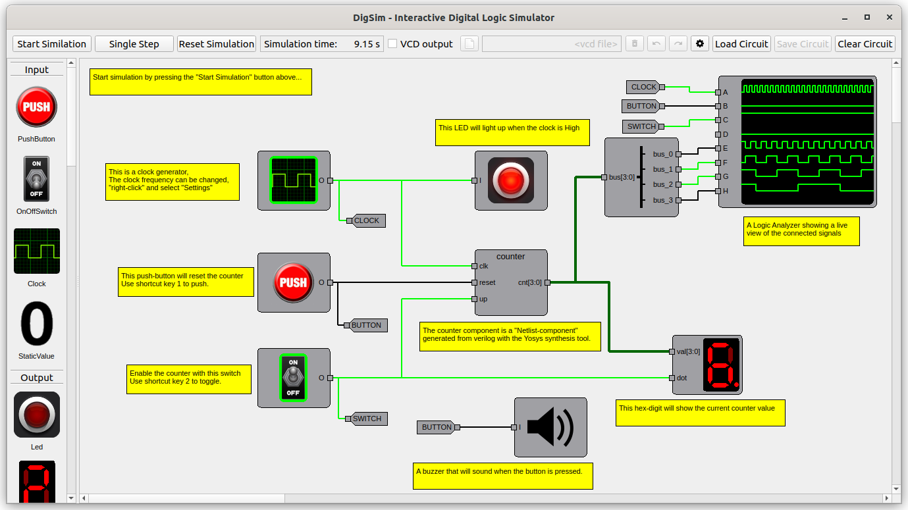

# DigSim - Interactive Digital Logic Simulator

<p align="center">
  
</p>

* **Table of contents**
  * [Introduction](#introduction)
  * [Quickstart](#quickstart)
  * [Yosys Helper Tool](#yosys-synthesis-helper-tool)
  * [Documentation](docs/documentation.md)
  * [Borrowed verilog](verilog/SOURCES.md)

## Introduction

DigSim is a python based framework used to simulate digital circuits. 
The main purpose of the software is to to, in an educational way, play around with digital logic components and components created in verilog.

When working with block design in Verilog/VHDL the simulation tools are often setup with test stimuli (a very non-interactive way of working...)
A block design can be synthesized and tested on an FPGA (where there are possibilities for interactivity if buttons and LED/Hexdigits are available),
but that is often have a great cost in time (and sometimes money) leading to long turnaround time. 

I started developing DigSim to make it easy to implement and visualize the functionality of simple verlog blocks. 
During developent I tried to synthesize larger verilog designs, such as the classic 6502 CPU, 
and even if it is slower than many other verilog simulators it is not entirely useless for larger designs.

### Features
 * Create and simulate a circuit using python code
 * Create and simulate a circuit **interactively** using the GUI
 * Create new components using synthesized verilog code
 * Save simulation results in VCD files, which can be opened in for example GTKWave.

## Quickstart

### Install
```
> python -m pip install .[app]
```

### Start Interactive GUI

```
> python -m digsim.app
```

### Start with example circuit
```
> python -m digsim.app --load example_circuits/yosys_counter.circuit
```

### Run examples
```
> python examples/example_sr.py
```

### Look at waveforms
```
> python examples/example_sr.py
> gtkwave sr.vcd
```

## Yosys synthesis helper tool

**Yosys** must be installed and in your path
```
> python -m digsim.synth -i <verilog file 1> <optional verilog file 2> -o <output_file.json> -t <verilog top_module>
```

## Development ToDo List

### Documentation
   * Add documentation :-)
### Model
   * Add unittest of all components
   * Add unittest of ports
