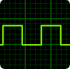
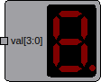
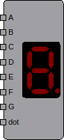
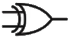
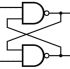
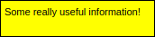

# DigSim Documentation

* **Table of contents**
  * **[GUI Application](#gui-application)**
    * [Circuit Editor](#circut-editor)
    * [Components](#components)
    * [Wires](#wires)
    * [Simulation](#simulation)
    * [VCD Generation](#vcd-generation)
  * **[Python Circuits](#python-circuits)**

# GUI Application

## Circuit Editor

The GUI application is a circuit editor where components can be added and connected together with wires.

A circuit will typically consist of:
 * One or several [Input Components](#input-components) i.e. Button(s) / Switch(es) / Clock(s)
 * Some logic such as [Gates](#logic-gates), [Flip Flops](#flip-flops) or more complex components
 * One or several [Output Components](#output-components) i.e. LED(s) / HexDigit(s) 

When a circuit has been greated it can be [Simulated](#simulation) and if [VCD Generation](#vcd-generation) 
is selected a vcd file will be created during simulation. 

The circuit editor is divided into a component selection window on the left hand side and a circuit area on the right hand side.

## Components

The different components are found on the left hand side of the application. 
To add a component simply double click it or drag it into the circuit area, on the right hand side of the application.

### Input Components

 * Push Button - A Push Button will change its output when it is pressed
   <br/> 
 * On/Off Switch - An on/off switch will change its output when it is toggled
   <br/>
 * Clock - A clock will change its output with a certain frequency
   <br/>
 * Static Value - A static value can be setup to output value on a wire or a bus.
   <br/>

### Output Components

* LED - A LED output will be lit if it is driver by a logic one / high signal.
  <br/>
* Hex Digit - A Hex Digit will show the value on a bus (4 / 8 / 12 / 16 bits)
  <br/>
* 7-Segment Display - A 7-Segment is almost the same as a hex digit but each segment can be controlled individually. 
  <br/>

### Logic Gates

<p float="left">





<p/>

These basic logic gates have been implemented, most of them can be configured with 2 to 8 inputs:
  * OR
  * AND
  * NOT
  * XOR
  * NOR
  * NAND
 
### Flip Flops

<p float="left">

</p>

The D Flip FLop symbol will let you add a D Flip Flop with configurable width and possibility to have clock enable and asynchronous reset.

<p float="left">

</p>

The Flip Flop component will let you pick one of the following Flip Flop types.

  * SR Flop Flop
  * Edge Triggered SR Flip Flop
  * Edge Triggered JK Flip Flop
  * Edge Triggered T Flip FLop

### Multiplexer

<p float="left">

</p>

The multiplexed component can be configured with 2 to 8 inputs and with a data width between 1 and 32 bits.

### Bus/Wire Converters

The Bus/Wire converters can either be used to split a bus into several bits or to merge several bits into a bus.

### IC Components

The IC components are pre-synthesized verilog components. More netlists, in Yosys json format,
can be added to the **src/digsim/circuit/components/ic** folder.

### Yosys Component

[Yosys](https://github.com/YosysHQ/yosys) is an open-source verilog synthesizer tool 

When adding a Yosys component the application will bring up a file dialog where you can choose a synthesized Yosys netlist in json formar.
It is possible to use the python synthesizer helper application to create the json netlist.  
```
shell> python3 -m digsim.synth -i <verilog file 1> <optional verilog file 2> -o <output_file.json> -t <verilog top_module>
```

It is also possible to start Yosys and do the exact same thing in the command line interface.

```
shell> yosys
```

For all my experiments I have found that the following "yosys-script" works out fine. 

```
yosys> read -sv <verilog_file.v>
yosys> hierarchy -top <verilog top module>
yosys> proc; flatten
yosys> memory_dff
yosys> proc; opt; techmap; opt;
yosys> synth -top <verilog top module>
yosys> write_json <netlist_file.json>
```

### Notes


<p float="left">

</p>

Notes with (or without) descriptive text can be added to the circuit.

## Wires

Wires are used to connect component ports. A source port can drive multiple sink ports. The source and sink port must be of the same type, i.e. a wire or a bus with the same bus width. If a a bus needs to be splitted the [Bus/Wire Converters](#buswire-converters) can be used.    

## Simulation

## VCD Generation

# Python Circuits

