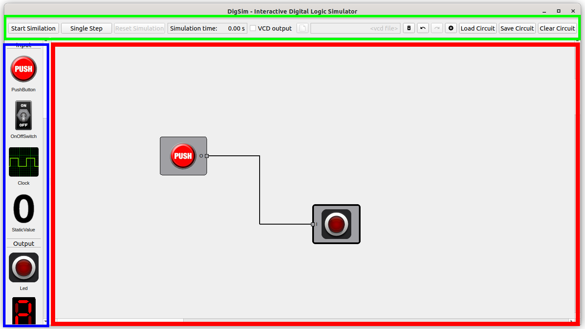
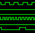

# DigSim Documentation

* **Table of contents**
  * **[GUI Application](#gui-application)**
	* [Circuit Editor](#circuit-editor)
	* [Components](#components)
	* [Wires](#wires)
	* [Simulation](#simulation)
	* [VCD Generation](#vcd-generation)
	* [Yosys Synthesis](#yosys-synthesis)

  * **[Python Circuits](#python-circuits)**

# GUI Application

The application is installed with:
```
shell> python3 -m pip install .[app]
```

The application is started with:
```
shell> python3 -m digsim.app
```

or with the following line if a stored circuit should be loaded from the start:
```
shell> python3 -m digsim.app --load example_circuits/yosys_counter.circuit
```

## Circuit Editor

The GUI application is a circuit editor where components can be added and connected together with wires.



The circuit editor is divided into:
 * A component selection area (the BLUE box), on the left hand side of the window.
 * A circuit area (the RED box), on the right hand side of the window.
 * A control area (the GREEN box) on the top side on the windows.

A circuit will typically consist of:
 * One or several [Input Components](#input-components) i.e. Button(s) / Switch(es) / Clock(s)
 * Some logic such as [Gates](#logic-gates), [Flip Flops](#flip-flops) or more complex components
 * One or several [Output Components](#output-components) i.e. LED(s) / Hex Digit(s)

When a circuit has been created it can be [Simulated](#simulation).

A circuit can be:
 * Saved
 * Loaded
 * Cleared

There are **Delete**, **Undo**, **Redo** and **Settings** buttons in the control area.

## Components

The different components are found on the left hand side of the application.
To add a component simply double click it or drag it into the circuit area, on the right hand side of the application.

Some components have a settings dialog that pop-up during creation. The settings dialog can also be reached by right-clicking
the component and selecting **Settings**.

Components can be:
 * Selected - By clicking on the component
 * Moved - By left-click dragging the component
 * Deleted - By right-clicking and selecting **Delete**, by pressing the **Del** key or by pressing the **Delete Button** in the control area.

### Input Components

 * Push Button - A Push Button will change its output when it is pressed
   <br/>
 * On/Off Switch - An on/off switch will change its output when it is toggled
   <br/>
 * Clock - A clock will change its output with a certain frequency
   <br/>
 * Static Value - A static value can be setup to output value on a wire or a bus.
   <br/>

***Shortcuts** can be added to the Push Button and to the Switch, a shortcut is a key-binding that can activate a
Push Button or toggle a Switch. The shortcut can be modified by right-clicking a component and select **Shortcut***.
 * Shortcut 1 is activated by pressing the key "1"
 * Shortcut 2 is activated by pressing the key "2"
 * ...
 * Shortcut 0 is activated by pressing the key "0"

### Output Components

* LED - A LED output will be lit if it is driver by a logic one / high signal.
  <br/>
* Hex Digit - A Hex Digit will show the value on a bus (4 / 8 / 12 / 16 bits)
  <br/>
* 7-Segment Display - A 7-Segment is almost the same as a hex digit but each segment can be controlled individually.
  <br/>
* Buzzer - A buzzer that can output a single tone
  <br/>
* Logic Analyzer - A logic analyzer to show signal levels in real-time
  <br/>

### Logic Gates
These basic logic gates have been implemented, most of them can be configured with 2 to 8 inputs:

<p float="left">


<p/>

 * OR
 * AND
 * NOT
 * XOR
 * NOR
 * NAND

### Flip Flops

 * The D Flip Flop symbol will let you add a D Flip Flop with configurable width and possibility to have clock enable and asynchronous reset.
 <br/>
 * The Flip Flop component will let you pick one of the following Flip Flop types.
 <br/>

	* SR Flop Flop
	* Edge Triggered SR Flip Flop
	* Edge Triggered JK Flip Flop
	* Edge Triggered T Flip FLop

### Multiplexer
The multiplexer component can be configured with 2, 4 or 8 inputs and with a data width between 1 and 32 bits.
<br/>

### Bus/Wire Converters

The Bus/Wire converters can either be used to split a bus into several bits or to merge several bits into a bus.

### IC Components

The IC components are pre-synthesized Yosys components. More netlists, in Yosys json format,
can be added to the **src/digsim/circuit/components/ic** folder.

### Yosys Component

Yosys components are components where the functionality is described by a netlist created from verilog with Yosys.
See chapter about [Yosys Synthesis](#yosys-synthesis).

When adding a Yosys component the application will bring up a file dialog where you can choose a Yosys netlist in json format.

When the yosys component has been added to the circuit it is possible to reload the netlist by right-clicking on the component and
select **Reload** in the context menu.

A test cycle could be like this:
 * Create verilog design
 * Do Yosys synthesis
 * Add yosys component to circuit
 * Connect component with other components
 * Run simulation to test functionality
 * Update verilog
 * Do Yosys synthesis
 * Right-click component and select **Reload**

***Important: The interface, input and output ports in the netlist must not change between load and reload.***

### Notes
 * Notes with (or without) informative text can be added to the circuit.
 <br/>

## Wires

Wires are used to connect component ports. A source port can drive multiple sink ports.
The source and sink port must be of the same type, i.e. a wire or a bus with the same bus width.
If a bus needs to be splitted the [Bus/Wire Converters](#buswire-converters) can be used.

## Simulation

When a circuit has been created with input component(s), automatic or manual controlled,
and output component(s) the circuit can be simulated.

 * A simulation can be started by clicking the **Start Simulation** button.
 * A running simulation can be stopped by clicking the **Stop Simulation** button.
 * The simulation can be reset by clicking the **Reset Simulation** button
 * The current simulation time can be seen in the control area.
 * A Push Button can be activated by clicking the component.
 * A Switch can be toggled by clicking the component.

## VCD Generation

If [VCD Generation](#vcd-generation) is activated, by checking the **VCD Output** checkbox in the control area,
a [VCD file](https://en.wikipedia.org/wiki/Value_change_dump) will be created during simulation.

The VCD File that later can be loaded into [GTKWave](https://gtkwave.sourceforge.net/) or similar tool.

## Yosys Synthesis

[Yosys](https://github.com/YosysHQ/yosys) is an open-source verilog synthesis tool.
It can be used to create a [netlist](https://en.wikipedia.org/wiki/Netlist), a list of gates and of they are connected, from [verilog](https://en.wikipedia.org/wiki/Verilog).

Yosys can be installed with your favorite packet manager, such as aptitude in Ubuntu.
```
shell> apt install yosys
```
If you want the latest and greatest version it can be fetched from [github](https://github.com/YosysHQ/yosys).

More information and documentation can be found [here](https://yosyshq.net/yosys/documentation.html).

When Yosys is installed it can be started, verilog can be loaded and the synthesis process can begin.

### Synthesis with command line interface

 * Start application
```
shell> yosys
```

* Execute synthesis script

For all my experiments I have used the following "yosys-script" with good results.

```
yosys> read -sv <verilog_file.v>
yosys> hierarchy -top <verilog top module>
yosys> proc; flatten
yosys> memory_dff
yosys> proc; opt; techmap; opt;
yosys> synth -top <verilog top module>
yosys> write_json <netlist_file.json>
```

### Synthesis with script

```
shell> yosys <synthesis_scriptfile.ys>
```

### Synthesis with python helper

It is possible to use my **python helper application** to create the json netlist.
```
shell> python3 -m digsim.synth synth -i <verilog file 1> <optional verilog file 2> -o <output_file.json> -t <verilog top_module>
```

# Python Circuits

Circuits can also be created in python code and mixed with *normal* python code.
See examples in the **examples** folder for inspiration.

## Run example
```
shell> python3 examples/example_sr.py
```

## Run example and look at waveforms
```
shell> python3 examples/example_sr.py
shell> gtkwave sr.vcd
```
